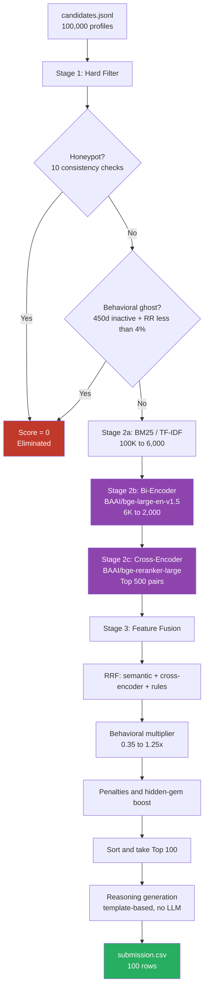
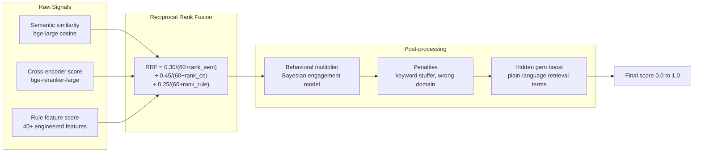
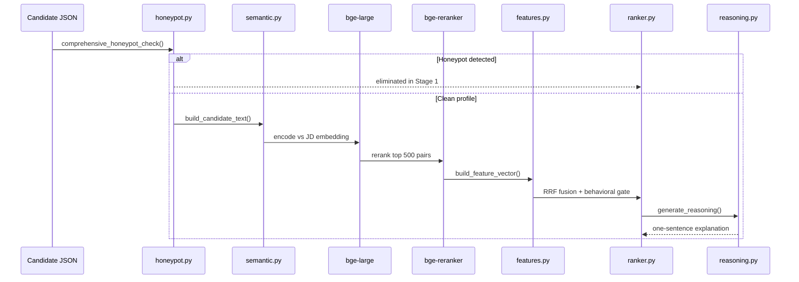
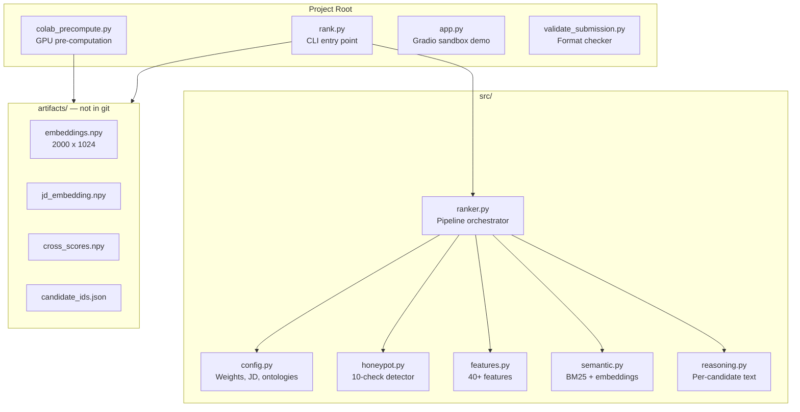
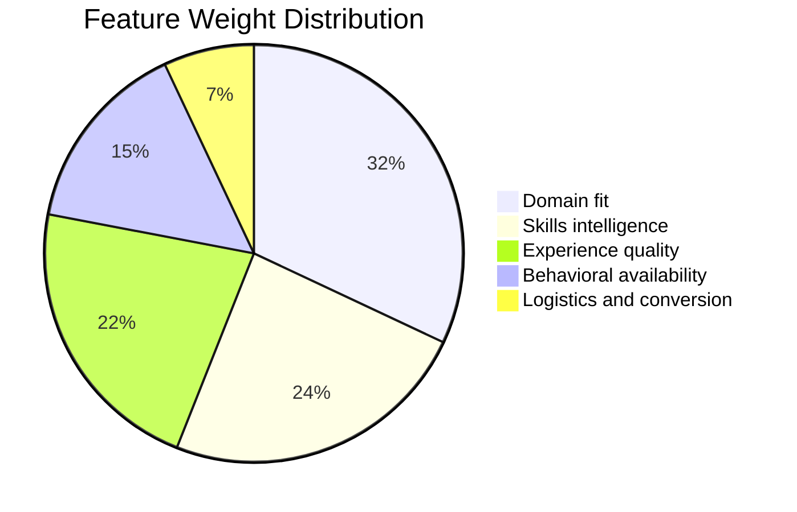
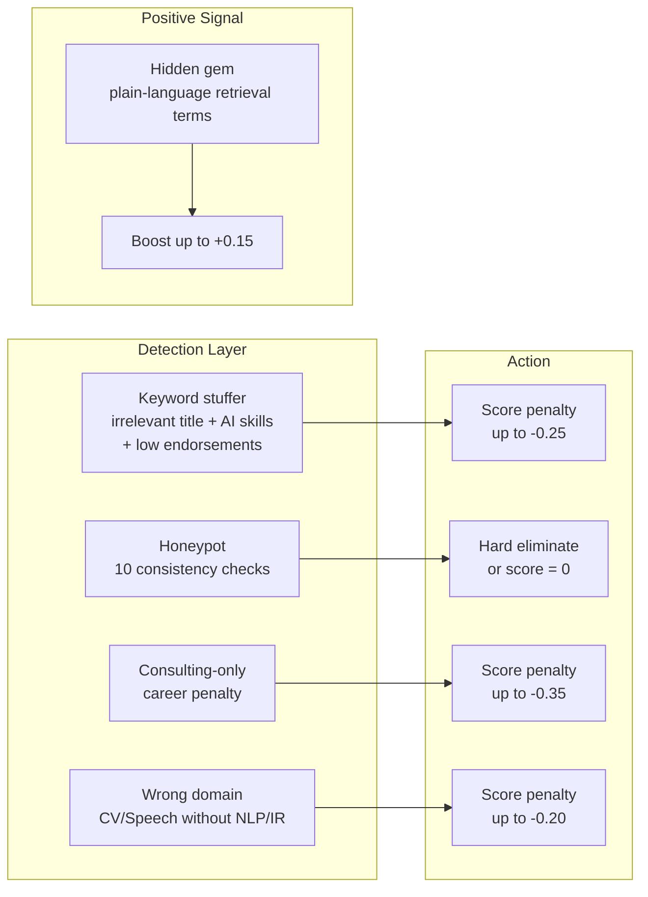
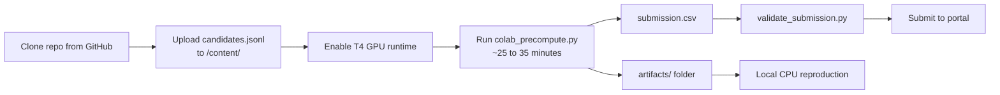

# Redrob Candidate Ranker

Hybrid retrieval-and-ranking system for the Redrob Intelligent Candidate Discovery challenge. Given 100,000 anonymized job-seeker profiles and a single Senior ML/AI Engineer job description, the pipeline identifies the top 100 best-fit candidates, assigns ranks and scores, and generates per-candidate reasoning — all within the hackathon compute constraints (CPU-only ranking, no API calls at inference time).

**Repository:** [github.com/TejasKadam001/redrob-recruiting-pipeline](https://github.com/TejasKadam001/redrob-recruiting-pipeline)


---

## Problem Statement

The challenge is not keyword matching. The dataset contains deliberate adversarial profiles:

| Trap type | Description | Our defense |
|-----------|-------------|-------------|
| Keyword stuffers | HR Managers listing 9 AI skills with no ML career history | Cross-validate skills against career descriptions; title-tier scoring |
| Hidden gems | Engineers who built retrieval systems but never wrote "RAG" or "Pinecone" | Semantic embeddings + plain-language boost terms |
| Behavioral twins | Identical skill sets, opposite availability signals | Behavioral multiplier applied multiplicatively, not additively |
| Honeypots | Impossible timelines, inverted salary ranges, future certifications | 10-check detector with hard elimination in Stage 1 |

The job description targets a **Senior ML/AI Engineer** focused on production retrieval, ranking, vector search, and hybrid IR — not generic data science or research-only backgrounds.

---

## Approach Overview

We use a three-stage funnel that mirrors production recruiting IR systems:

1. **Hard filter** — remove honeypots and unreachable profiles before any expensive computation.
2. **Semantic retrieval** — BM25 pre-filter, bi-encoder embeddings, cross-encoder reranking (GPU pre-computed).
3. **Feature fusion** — 40+ engineered signals combined via Reciprocal Rank Fusion (RRF), behavioral gating, and trap penalties.

Pre-computation on Google Colab T4 GPU is allowed. The final ranking step that produces `submission.csv` completes in under 60 seconds on CPU with pre-computed artifacts.

---

## System Architecture



---

## Scoring Pipeline



**Stage weights** (defined in `src/config.py`):

| Signal | Weight | Rationale |
|--------|--------|-----------|
| Cross-encoder | 0.45 | Sees full JD + candidate pair; highest precision |
| Semantic (bi-encoder) | 0.30 | Captures meaning beyond keywords |
| Rule features | 0.25 | Domain fit, traps, structured JD requirements |

Behavioral signals (recruiter response rate, recency, notice period, open-to-work) are applied as a **multiplier** (0.35–1.25), not added to the score. A qualified but unreachable candidate ranks lower than an equally qualified active one.

---

## Single-Candidate Data Flow



---

## Repository Structure



| Path | Purpose |
|------|---------|
| `rank.py` | Main CLI — produces `submission.csv` from candidates + optional artifacts |
| `colab_precompute.py` | Full GPU pipeline on Colab; writes `submission.csv` and `artifacts/` |
| `app.py` | Gradio demo for sandbox submission (up to 150 candidates) |
| `validate_submission.py` | Official format validator (100 rows, score ordering, ID format) |
| `src/config.py` | Single source of truth for all weights, JD text, skill ontology |
| `src/honeypot.py` | Honeypot detection with confidence scoring |
| `src/features.py` | Feature engineering across 5 signal groups |
| `src/semantic.py` | Text building, BM25, bi-encoder, cross-encoder |
| `src/ranker.py` | Three-stage pipeline orchestrator |
| `src/reasoning.py` | Deterministic reasoning generation (no LLM, no API calls) |

---

## Feature Engineering

Forty-plus features grouped by recruiting signal type. Weights sum to 1.0 in `FEATURE_WEIGHTS`.



**Domain fit (32%)** — title tier taxonomy, career trajectory toward ML, product-company ratio, retrieval-specificity scoring, industry relevance.

**Skills intelligence (24%)** — ontology-matched skills weighted by tier (CRITICAL / IMPORTANT / NICE_TO_HAVE), endorsements, proficiency, skill-pair synergy (e.g. FAISS + embeddings), skill recency in career history.

**Experience quality (22%)** — years-of-experience fit (5–9 yr sweet spot), recent ML work, longest ML tenure, quantified production impact, education tier and field.

**Behavioral availability (15%)** — platform recency (exponential decay), recruiter response rate, open-to-work flag, notice period, interview completion rate, profile trust signals.

**Logistics (7%)** — location fit (Noida/Pune preferred), salary range sanity, application activity, offer acceptance rate.

---

## Anti-Trap Defense



Honeypot checks include: experience vs career timeline mismatch, skill duration exceeding total career, future certification dates, inverted salary ranges, education-career overlap, future job start dates, and signup date anomalies.

Disqualification threshold: more than 10% honeypots in the submitted top 100.

---

## Models

| Component | Model | Params | Where it runs |
|-----------|-------|--------|---------------|
| Bi-encoder (production) | `BAAI/bge-large-en-v1.5` | 335M | Colab T4 GPU (pre-compute) |
| Cross-encoder (reranker) | `BAAI/bge-reranker-large` | 560M | Colab T4 GPU (top 500 pairs) |
| Bi-encoder (CPU fallback) | `BAAI/bge-small-en-v1.5` | 33M | Local CPU reproduction |

The JD is encoded with the BGE query instruction prefix. Candidate documents use career descriptions double-weighted in the embedding text. Cosine similarity is computed on L2-normalized vectors.

No generative LLM is used at ranking time. Reasoning is produced by deterministic, rank-tier-specific templates that reference only facts present in each candidate profile.

---

## Quick Start

### Prerequisites

- Python 3.10+
- 16 GB RAM (for full CPU run)
- Google Colab with T4 GPU (for pre-computation)

### Install

```bash
git clone https://github.com/TejasKadam001/redrob-recruiting-pipeline.git
cd redrob-recruiting-pipeline
pip install -r requirements.txt
```

Place `candidates.jsonl` in the project root (not included in git — 465 MB).

### Reproduce Command (Stage 3)

With pre-computed artifacts (recommended):

```bash
python rank.py --candidates ./candidates.jsonl --artifacts ./artifacts/ --out ./submission.csv
```

Runtime: under 60 seconds on CPU, no network required.

CPU-only without artifacts:

```bash
python rank.py --candidates ./candidates.jsonl --out ./submission.csv
```

Runtime: approximately 4 minutes on 16 GB CPU.

### Validate Before Upload

```bash
python validate_submission.py submission.csv
```

Expected output: `Submission is valid.`

---

## Google Colab Workflow

The recommended path for final submission. Upload `candidates.jsonl` to Colab once; clone the repo for all code.



**Colab cells:**

```python
# Cell 1 — Clone
!git clone https://github.com/TejasKadam001/redrob-recruiting-pipeline.git /content/project
%cd /content/project
```

```python
# Cell 2 — Verify dataset (upload candidates.jsonl to /content/ first)
!ls -lh /content/candidates.jsonl
```

```python
# Cell 3 — Install and check GPU
!pip install -q -r requirements.txt
import torch; print("CUDA:", torch.cuda.is_available())
```

```python
# Cell 4 — Run full pipeline
import sys
from pathlib import Path
sys.path.insert(0, "/content/project")
script = Path("colab_precompute.py").read_text()
script = script.replace('sys.path.insert(0, "/content")', 'sys.path.insert(0, "/content/project")')
exec(script)
```

```python
# Cell 5 — Validate and download
!python validate_submission.py /content/submission.csv
from google.colab import files
files.download("/content/submission.csv")
```

---

## Output Format

```csv
candidate_id,rank,score,reasoning
CAND_0077337,1,0.9900,"Staff Machine Learning Engineer, 7.0 yrs at Paytm (Kochi, Kerala); built retrieval/ranking systems (Staff Machine Learning Engineer at Paytm). RR 95%, 60d notice."
```

| Column | Constraint |
|--------|------------|
| `candidate_id` | Format `CAND_XXXXXXX` (7 digits), unique |
| `rank` | Integers 1–100, each exactly once |
| `score` | Float, strictly non-increasing by rank |
| `reasoning` | Optional but recommended; one concise sentence per candidate |

---

## Gradio Sandbox

Deploy to HuggingFace Spaces for the hackathon sandbox requirement:

```bash
pip install gradio
python app.py
```

Or deploy `app.py` + `src/` + `requirements_hf.txt` to a HuggingFace Space (Gradio SDK). The demo accepts up to 150 candidates and returns a ranked table with debug scores.

---

## Design Decisions

**Why RRF instead of raw score addition?**
Semantic cosine similarity, cross-encoder logits, and rule features live on incompatible scales. Reciprocal Rank Fusion combines ranks, not raw values, which is robust to miscalibrated score distributions and is standard in production hybrid search.

**Why pre-compute on GPU?**
Encoding 100,000 profiles with bge-large plus reranking 500 pairs exceeds the 5-minute CPU ranking window. Pre-computation is explicitly allowed; only the final ranking step is timed.

**Why no LLM for reasoning?**
Hackathon rules penalize model usage during ranking. Template-based reasoning references only verified profile facts, passes manual review criteria (specificity, JD connection, honest gaps, variation), and carries zero hallucination risk.

**Why behavioral multiplier instead of additive scoring?**
A candidate who has not logged in for eight months with a 5% response rate is not equally available as an identical on-paper profile with 80% response rate. Multiplicative gating models hiring reachability more accurately than adding a flat behavioral bonus.

---

## Compute Environment

| Step | Platform | Time |
|------|----------|------|
| Pre-computation | Google Colab T4 GPU | 25–35 min |
| Ranking (with artifacts) | CPU 16 GB RAM | under 60 sec |
| Ranking (CPU-only) | CPU 16 GB RAM | ~4 min |
| Network during ranking | None | Required offline |

---

## Team and Submission

See `submission_metadata.yaml` for team contact, reproduce command, AI tool declarations, and methodology summary.

---

## License

Built for the Redrob Intelligent Candidate Discovery and Ranking Challenge.
